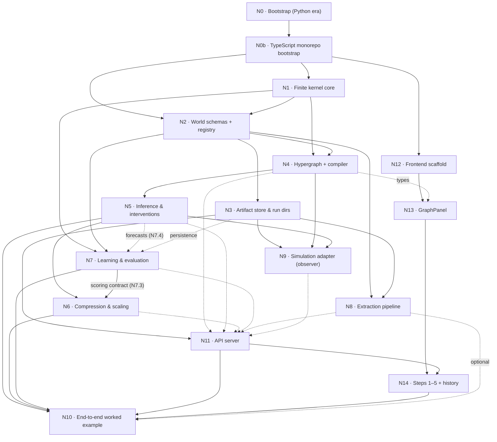

# c2p work DAG

Source of truth for node scope and acceptance: `progress/prompt/init.md` §2.
Substage names follow `progress/prompt/category_theory_scaling_memo.md` §4.4.
Module paths in substages are the memo's Python names; the TypeScript port puts
each module under the directory named in that node's init.md §2 scope
(`packages/core/src/…` or `packages/server/src/…`). The Python in
`reference/python/` is a test oracle only (decisions D9, D11).
A node is done only when its acceptance tests pass and the verifier output is
pasted into its record below, in the same commit as the node.

Status values: `pending` · `in-progress` · `done` · `blocked`.



Dashed edges are partial or optional: N7.1–N7.3 need only N1 and N2, while the
N7.4 forecast backtest also needs N5 and persistence goes through N3; N11 starts
after N3 and its route groups grow as N4–N9 land; N13 needs only N4's types;
N10 may run without N8.

## Waves

Suggested waves (Node and frontend first, per the user; init.md §2):
N0b → {N1, N12} → {N2, N13 shell} → {N3, N4, N11 skeleton} →
{N5, N7, N8, N14 steps 1–2} → {N6, N9, N14 steps 3–5} → N10.

---

### N0 — Bootstrap (Python era)

- status: `done`
- depends: none
- substages: none (single node; no memo §4.4 row)
- acceptance: done (init.md §2). As verified at the time:
  - `python3 -m pytest -q` green
  - hook rejects a bad title
  - `git status` shows no `Chandra/` or `ref-code/`
- commits: the `build(repo)` bootstrap commit (`c756cf4`)
- verifier (run by the orchestrator):

```text
$ python3 -m pytest
...                                                                      [100%]
3 passed in 0.06s
$ bash Chandra/_common/hooks/commit-msg <'bad title'>          -> exit=1
$ bash Chandra/_common/hooks/commit-msg <'feat(core): add smoke test'> -> exit=0
$ git status --short
?? .gitignore
?? mission.json
?? progress/c2p/
?? pyproject.toml
?? src/
?? tests/
```

### N0b — TypeScript monorepo bootstrap

- status: `done`
- depends: N0
- substages: none (single node; no memo §4.4 row). Python moved to
  `reference/python/` in `f4dfd05`; toolchain choices in decisions D13
- acceptance:
  - `npm test` and `npm run typecheck` green
  - `cd reference/python && python3 -m pytest` → 55 passed
  - a test asserts `@c2p/core` has no runtime `dependencies`
  - `git status` clean of build output
- commits: the `build(repo)` TypeScript monorepo bootstrap commit
- verifier (run by the orchestrator):

```text
$ npm test
 ✓ |core| packages/core/test/smoke.test.ts (4 tests) 9ms
 ✓ |core| packages/core/test/golden.test.ts (3 tests) 20ms
 ✓ |server| packages/server/test/health.test.ts (1 test) 242ms
 ✓ |frontend| frontend/src/App.test.ts (1 test) 25ms
 Test Files  4 passed (4)
      Tests  9 passed (9)
$ npm run typecheck   -> exit 0
$ npm run build       -> exit 0 (core, server, frontend dist)
$ npm run golden:check
golden check: ok (2 files)
$ cd reference/python && python3 -m pytest
55 passed in 0.22s
$ server start + curl /api/health (worker run, PORT=5099)
{"status":"ok","core":"0.1.0"}
```

### N1 — Finite kernel core

- status: `done`
- depends: N0b
- substages: Python oracle done; TypeScript port pending. Single stage — port the
  guide §12.1/§12.2 reference API to `packages/core/src/kernels.ts` with Shewchuk
  `fsum` and BigInt `Rational` (memo tests `test_reference_17`, `test_tensor_order`)
- acceptance:
  - all 17 guide reference cases + the oracle's extra cases pass in vitest
  - golden parity ≤ 1e-12 and identical product value strings/orders
  - the §13 numbers (0.36, 0.39, 0.25) / (0.09, 0.28, 0.63)
  - `fsum` equals Python `math.fsum` on adversarial golden inputs
- commits: the `feat(kernels)` finite kernel commit (Python oracle, `f9cab31`;
  moved to `reference/python/` in `f4dfd05`); TypeScript port pending
- verifier (run by the orchestrator):

```text
$ python3 -m pytest tests/test_smoke.py tests/test_kernels.py
24 passed in 0.04s
$ python3 -m pytest tests/test_kernels.py -k reference
17 passed, 4 deselected in 0.06s
$ AST diff of src/c2p/kernels.py vs guide §12.1 (docstrings stripped)
guide defs: 11 mismatched: [] extra: [product_all]
$ forecast((1,0,0), baseline|extra_crew, 2)
[0.36, 0.39, 0.25] [0.09, 0.28, 0.63]
```
- TypeScript port verifier (run by the orchestrator; commit: the `feat(kernels)` TypeScript port):

```text
$ npx vitest run --project core
 ✓ |core| packages/core/test/golden.test.ts (7 tests) 22ms
 ✓ |core| packages/core/test/smoke.test.ts (4 tests) 9ms
 ✓ |core| packages/core/test/kernels.test.ts (26 tests) 208ms
 ✓ |core| packages/core/test/json.test.ts (44 tests) 57ms
 ✓ |core| packages/core/test/kernels.golden.test.ts (40 tests) 219ms
 ✓ |core| packages/core/test/rational.test.ts (226 tests) 259ms
 ✓ |core| packages/core/test/fsum.test.ts (56 tests) 362ms
 ✓ |core| packages/core/test/thenable.test.ts (3 tests) 437ms
   ✓ no thenable core types (3)
     ✓ no class in packages/core/src declares a `then` member 376ms
 Test Files  8 passed (8)
      Tests  406 passed (406)
$ npm run golden:check
golden check: ok (6 files)
$ async return of a Kernel (thenable regression)
async return ok: true 'then' in k: false
$ cd reference/python && python3 -m pytest
55 passed in 0.23s
```

### N2 — World schemas + registry

- status: `done`
- depends: N0b, N1
- substages: Python oracle done; TypeScript port pending. N2.1 records → N2.2
  validators (`world/records.py`, `world/validation.py`; registry in
  `causal/registry.py`; memo tests `test_identity_and_links`,
  `test_roles_and_kinds`, `test_strict_eligibility`, `test_conflicts`). TS:
  `core/src/store/records.ts`, `core/src/world/*`, `core/src/causal/registry.ts`
- acceptance:
  - identity across documents
  - same-name entities not merged
  - roles round-trip with half-open intervals, inverted intervals and cross-namespace links rejected
  - subtype graph is a DAG
  - `"false"` rejected
  - events/locations/topics/artifacts never eligible
  - a value of the wrong kind's domain is rejected
  - the guide §4.2 JSON round-trips
  - **golden verdict parity** with the oracle on a shared accept/reject corpus
- commits: Python reference: `feat(world)` 4690d2b (N2.1+N2.2) and the `feat(causal)` registry commit (N2.3); TypeScript port pending
- verifier (run by the orchestrator):

```text
$ python3 -m pytest   (N2.1 + N2.2 + N2.3 registry)
55 passed in 0.46s
$ python3 -m pytest tests/test_causal_registry.py
5 passed in 0.05s
```
- TypeScript port verifier (run by the orchestrator; commit: the `feat(world)` TypeScript port):

```text
$ npx vitest run --project core
 ✓ |core| packages/core/test/world.kinds.test.ts (8 tests) 17ms
 ✓ |core| packages/core/test/causal.registry.test.ts (7 tests) 46ms
 ✓ |core| packages/core/test/world.records.test.ts (36 tests) 46ms
 ✓ |core| packages/core/test/store.records.test.ts (14 tests) 44ms
 ✓ |core| packages/core/test/world.validation.test.ts (9 tests) 78ms
 ✓ |core| packages/core/test/world.golden.test.ts (309 tests) 190ms
 Test Files  14 passed (14)
      Tests  790 passed (790)
$ npx tsc -b -> exit 0
$ npm run golden:check
golden check: ok (7 files)
$ cd reference/python && python3 -m pytest
55 passed in 0.43s
golden corpus world_verdicts.json: 307 cases (98 ok / 209 raises), verdict + normalized-output parity
```

### N3 — Artifact store & run dirs

- status: `done`
- depends: N2
- substages: N3.1 canonical bytes → N3.2 storage (`store/records.py`, `store/artifacts.py`;
  memo test `test_hash_and_namespace`). TS: `server/src/store/` (decisions D12)
- acceptance:
  - idempotent writes
  - scenario namespaces cannot contaminate each other
  - observed and simulated records separable only by explicit origin filter
  - tamper detection on read
  - path traversal rejected
- commits: the `feat(store)` artifact store commit
- verifier (run by the orchestrator):

```text
$ npx vitest run --project server
 ✓ |server| packages/server/test/store.runs.test.ts (5 tests) 110ms
 ✓ |server| packages/server/test/store.artifacts.test.ts (5 tests) 165ms
 ✓ |server| packages/server/test/health.test.ts (1 test) 93ms
 Test Files  3 passed (3)
      Tests  11 passed (11)
$ npx tsc -b -> exit 0
mutation checks by the worker: removing re-hash-on-read, immutable names, conflicting-duplicate check, post-manifest block each fail a test
```

### N4 — Hypergraph + compiler

- status: `done`
- depends: N1, N2
- substages: N4.1 specs/keys → N4.2 bindings → N4.3 compiler (`causal/specs.py`,
  `causal/templates.py`, `causal/compiler.py`; memo tests `test_ports_and_writers`,
  `test_temporal_plan`, `test_family_invariance`)
- acceptance:
  - swapped named ports, incompatible domains/order/units, missing kernels, multiple writers, same-time cycles fail
  - valid unrolled feedback compiles
  - future reads rejected
  - reordering entities changes neither family assignment nor domain indices
  - no knowledge/event edge is ever promoted to a mechanism
- commits: the `feat(causal)` hypergraph compiler commit
- verifier (run by the orchestrator):

```text
$ npx vitest run --project core
 ✓ |core| packages/core/test/causal.specs.test.ts (7 tests) 82ms
 ✓ |core| packages/core/test/causal.registry.test.ts (7 tests) 175ms
 ✓ |core| packages/core/test/causal.compiler.test.ts (8 tests) 296ms
 ✓ |core| packages/core/test/causal.templates.test.ts (8 tests) 306ms
 Test Files  22 passed (22)
      Tests  852 passed (852)
$ npx tsc -b packages/core packages/core/test -> exit 0 (top-level exports wired: causal, learn, evaluate, compress, lgamma; no export collisions)
guide 13 incident plan: 2 nodes in tick order; kernels forecast (0.36, 0.39, 0.25) / (0.09, 0.28, 0.63)
test_budget_before_product: over-budget compile makes 0 calls to product/productAll
```

### N5 — Inference & interventions

- status: `pending`
- depends: N4
- substages: N5.1 enumeration → N5.2 Bayes → N5.3 surgery (`inference/exact.py`,
  `inference/interventions.py`; memo tests `test_observe_vs_do`,
  `test_identification_fixture`)
- acceptance:
  - surgery removes the original input dependence and leaves others fixed
  - §8.3 models A/B agree observationally and give 1 vs 1/2 under do(X=1)
  - counterfactual requests rejected
- commits:
- verifier:

```text
```

### N6 — Compression & scaling

- status: `pending`
- depends: N5, N7 scoring contract (N7.3), the memo (ADOPT-NOW set, §4.3–§4.4)
- substages:
  - N6.1 pooling/shrinkage (`compress/families.py`; memo tests `test_pooling`, `test_shrinkage`)
  - N6.2 aggregates/budgets (`compress/aggregation.py`, `causal/compiler.py`; `test_aggregation`, `test_budget_before_product`)
  - N6.3 abstraction/counts (`compress/abstraction.py`, `compress/counts.py`; `test_lumpability`, `test_sampled_defect`, `test_count_symmetry`, `test_scaling_arithmetic`)
  - N6.4 slice (`compress/slicing.py`; `test_slice_with_evidence`)
  - N6.5 particles (`inference/particles.py`; `test_shared_cache`, `test_particle_oracle`)
  - N6.rank: artifact → PPR → coefficients → certificates → scheduling (`compress/ranking.py`,
    `compress/influence.py`, `store/artifacts.py`; `test_ppr_star_chain`, `test_ppr_direction`,
    `test_inert_hub`, `test_two_path_bound`, `test_pruning_certificate`, `test_score_artifact`,
    `test_priorities`). Internal substage, not the deferred N6b (decisions D5).
- acceptance:
  - pooling equals concatenated eligible counts, and origin/regime/interface mismatches fail
  - an unseen row equals its prior and is flagged
  - a lumpable partition gives δ = 0 and a non-lumpable one δ > 0
  - $\mathrm{TV}\le\min(1,h\delta)$ holds from every point-mass start
  - sliced and full exact answers agree, including evidence on another branch
  - small exchangeable kernels agree with the count generator
  - parameter counts reproduce memo §5.1 (486,000 / 2,916 / 72)
  - memo §5.2 inert-hub and two-path fixtures
  - ranking leaves kernel hashes unchanged
  - N6.rank (memo §4.4, binding per decisions D5): the `test_*` assertions listed for N6.rank above
- commits:
- verifier:

```text
```

### N7 — Learning & evaluation

- status: `in-progress`
- depends: N1, N2 (N5 for forecasts, i.e. N7.4; persistence via N3)
- substages: N7.1 datasets → N7.2 sparse row fitter → N7.3 scoring/gate contract
  (`learn/datasets.py`, `learn/rows.py`, `compress/scoring.py`, `evaluate/gate.py`;
  memo tests `test_complete_rows`, `test_prior_fallback`, `test_prequential_gamma`,
  `test_frozen_gate`, `test_structure_code`) → N7.4 backtest after N5
  (`evaluate/backtest.py`, `evaluate/metrics.py`; `test_common_population`, `test_report`)
- acceptance:
  - sequential-predictive and log-gamma code lengths agree in bits (ordered sequence, no multinomial coefficient)
  - an unseen row returns the prior and is flagged as such
  - no cutoff, entity/episode, or hyperparameter leakage
  - baselines use the identical split
  - an impossible outcome gives visible infinite NLL/error
- commits: N7.1-N7.3 `feat(learn)` datasets/rows/scoring/gate commit; N7.4 backtest pending
- verifier (run by the orchestrator):

```text
$ npx vitest run --project core   (N7.1-N7.3 files)
 ✓ |core| packages/core/test/learn.rows.test.ts (5 tests) 60ms
 ✓ |core| packages/core/test/evaluate.gate.test.ts (10 tests) 71ms
 ✓ |core| packages/core/test/numeric.lgamma.test.ts (8 tests) 85ms
 ✓ |core| packages/core/test/compress.scoring.test.ts (5 tests) 179ms
 ✓ |core| packages/core/test/learn.datasets.test.ts (11 tests) 111ms
 Test Files  22 passed (22)
      Tests  852 passed (852)
$ npx tsc -b packages/core packages/core/test -> exit 0
pending: N7.4 rolling-origin backtest (needs N5)
```

### N8 — Extraction pipeline

- status: `pending`
- depends: N2, N3
- substages: no numbered memo substages; memo §4.4 consumer row: strict boundary
  validation → selection/logging (`extract/validation.py`; memo test `test_boundary_schemas`).
  TS: `server/src/extract/`
- acceptance:
  - the six-entity fixture (2 people, 1 org, 1 meeting, 1 location, 1 document) keeps all six
  - only eligible actors are emitted as agent candidates
  - world count and agent count are separate outputs
- commits:
- verifier:

```text
```

### N9 — Simulation adapter (observer)

- status: `pending`
- depends: N3, N4, N5
- substages: no numbered memo substages; memo §4.4 consumer row: strict boundary
  validation → logging → replay (`adapters/observer.py`; memo tests `test_boundary_schemas`,
  `test_observer_replay`). TS: `server/src/adapters/`
- acceptance:
  - inactive / explicit-no-action / failed / missing remain distinct
  - replay reproduces the numeric state updates
  - one state authority per variable
- commits:
- verifier:

```text
```

### N11 — API server

- status: `pending`
- depends: N3 (routes grow with N4–N9)
- substages: skeleton (wave 3) → route groups `/api/world`, `/api/model`,
  `/api/forecast`, `/api/report` + persisted tasks as N4–N9 land (`server/src/api/`;
  no memo §4.4 row)
- acceptance:
  - `fastify.inject` tests
  - cross-project IDs and path traversal rejected
  - tasks survive a restart
  - the report endpoint returns `missing` (not a number) for absent calibration
  - no network
- commits:
- verifier:

```text
```

### N12 — Frontend scaffold

- status: `done`
- depends: N0b
- substages: none (single node; no memo §4.4 row). `frontend/`: Vue 3 + Vite +
  vue-router + vue-i18n (en, zh) + axios + d3; Home and Process (STEP 01–05 shell);
  `src/api/` per route group; Vite dev proxy
- acceptance:
  - `npm run build -w frontend` passes
  - vitest + @vue/test-utils smoke tests
  - no MiroFish code copied (AGPL)
- commits: the `feat(frontend)` scaffold commit
- verifier (run by the orchestrator):

```text
$ npx vitest run --project frontend
 Test Files  9 passed (9)
      Tests  46 passed (46)
$ npx vue-tsc --noEmit -p frontend   -> exit 0
$ npm run build -w frontend
dist/index.html                   0.60 kB │ gzip:  0.35 kB
dist/assets/index-CHnZZZuU.css   17.02 kB │ gzip:  3.58 kB
dist/assets/index-B-b0iXuz.js   220.28 kB │ gzip: 80.70 kB
✓ built in 1.32s
$ grep for MiroFish identifiers/strings in frontend/src (next-step-btn, step-badge, MiroFish, 图谱构建, 群体智能) -> 0 files
$ headless screenshots: Home 1280px, Process 1280px and 375px rendered; server-unavailable states shown
```

### N13 — GraphPanel

- status: `done`
- depends: N12, N4 (types)
- substages: shell (wave 2) → World and Mechanism views once N4 types exist
  (no memo §4.4 row)
- acceptance:
  - component tests: variable and mechanism nodes never appear in agent lists
  - ports render in declared order
  - observed / extracted / assumed / simulated are visually distinct
- commits: the `feat(graph)` GraphPanel commit
- verifier (run by the orchestrator):

```text
$ npx vitest run --project frontend
 Test Files  14 passed (14)
      Tests  97 passed (97)
$ npx vue-tsc --noEmit -p frontend   -> exit 0
$ headless screenshots reviewed: world view (6 entities, 2 agent candidates, separate role/participation/claim layers), mechanism view (ports 0 status, 1 crew, 2 supplies; one output), 1280 and 375 px, light and dark
note: some edge labels overlap in the world view (cosmetic, revisit in N14)
```

### N14 — Steps 1–5 + history

- status: `pending`
- depends: N13, N11
- substages: steps 1–2 (world build, model setup) → steps 3–5 (forecast & simulate,
  report, interaction) + history (no memo §4.4 row)
- acceptance:
  - e2e against an in-process server with a mocked LLM: the six-entity fixture flows through steps 1–4
  - Step 4 never shows a number for missing calibration
- commits:
- verifier:

```text
```

### N10 — End-to-end worked example

- status: `pending`
- depends: N5, N6, N7, N11, N14 (N8 optional)
- substages: N7.4 → N10 integration (memo test `test_incident_end_to_end`);
  guide §13 incident example through core → API → UI, plus a synthetic backtest
- acceptance:
  - 0.25 vs 0.63 via the API and in Step 4
  - missing calibration shown as missing
- commits:
- verifier:

```text
```
