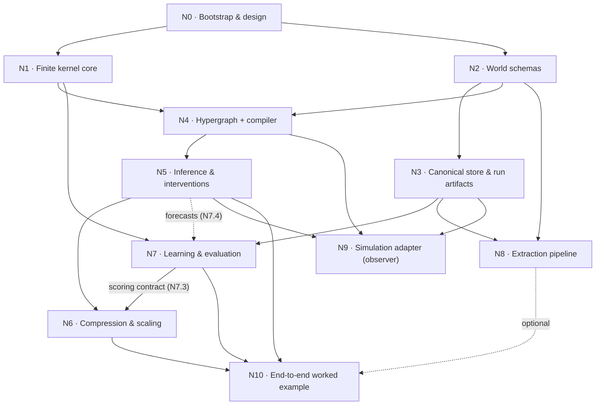

# c2p work DAG

Source of truth for node scope and acceptance: `progress/prompt/init.md` §2.
Substage names follow `progress/prompt/category_theory_scaling_memo.md` §4.4.
A node is done only when its acceptance tests pass and the verifier output is
pasted into its record below, in the same commit as the node.

Status values: `pending` · `in-progress` · `done` · `blocked`.



Dashed edges are partial or optional: N7.1–N7.3 need only N1 and N3, while the
N7.4 forecast backtest also needs N5; N10 may run without N8.

---

### N0 — Bootstrap & design

- status: `done`
- depends: none
- substages: none (single node; no memo §4.4 row)
- acceptance:
  - `python3 -m pytest -q` green
  - hook rejects a bad title
  - `git status` shows no `Chandra/` or `ref-code/`
- commits: the `build(repo)` bootstrap commit
- verifier (run by the orchestrator):

```text
$ python3 -m pytest
...                                                                      [100%]
3 passed in 0.06s
$ bash Chandra/_common/hooks/commit-msg <'bad title'>          -> exit=1
$ bash Chandra/_common/hooks/commit-msg <'feat(core): add smoke test'> -> exit=0
$ git status --short
?? .gitignore
?? mission.json
?? progress/c2p/
?? pyproject.toml
?? src/
?? tests/
```

### N1 — Finite kernel core

- status: `done`
- depends: N0
- substages: single stage — port the guide §12.1/§12.2 reference API to `kernels.py`
  (memo tests `test_reference_17`, `test_tensor_order`)
- acceptance:
  - all 17 reference tests pass, including the guide §13 numbers (0.36, 0.39, 0.25) / (0.09, 0.28, 0.63)
- commits: the `feat(kernels)` finite kernel commit
- verifier (run by the orchestrator):

```text
$ python3 -m pytest tests/test_smoke.py tests/test_kernels.py
24 passed in 0.04s
$ python3 -m pytest tests/test_kernels.py -k reference
17 passed, 4 deselected in 0.06s
$ AST diff of src/c2p/kernels.py vs guide §12.1 (docstrings stripped)
guide defs: 11 mismatched: [] extra: [product_all]
$ forecast((1,0,0), baseline|extra_crew, 2)
[0.36, 0.39, 0.25] [0.09, 0.28, 0.63]
```

### N2 — World schemas

- status: `done`
- depends: N0
- substages: N2.1 records → N2.2 validators (`world/records.py`, `world/validation.py`;
  registry in `causal/registry.py`; memo tests `test_identity_and_links`,
  `test_roles_and_kinds`, `test_strict_eligibility`, `test_conflicts`)
- acceptance:
  - identity across documents
  - same-name entities not merged
  - roles round-trip with half-open intervals, inverted intervals and cross-namespace links rejected
  - subtype graph is a DAG
  - `"false"` rejected
  - events/locations/topics/artifacts never eligible
  - a value of the wrong kind's domain is rejected
- commits: Python reference: `feat(world)` 4690d2b (N2.1+N2.2) and the `feat(causal)` registry commit (N2.3); TypeScript port pending
- verifier (run by the orchestrator):

```text
$ python3 -m pytest   (N2.1 + N2.2 + N2.3 registry)
55 passed in 0.46s
$ python3 -m pytest tests/test_causal_registry.py
5 passed in 0.05s
```

### N3 — Canonical store & run artifacts

- status: `pending`
- depends: N2
- substages: N3.1 canonical bytes → N3.2 storage (`store/records.py`, `store/artifacts.py`;
  memo test `test_hash_and_namespace`)
- acceptance:
  - idempotent writes
  - scenario namespaces cannot contaminate each other
  - path traversal rejected
- commits:
- verifier:

```text
```

### N4 — Hypergraph + compiler

- status: `pending`
- depends: N1, N2
- substages: N4.1 specs/keys → N4.2 bindings → N4.3 compiler (`causal/specs.py`,
  `causal/templates.py`, `causal/compiler.py`; memo tests `test_ports_and_writers`,
  `test_temporal_plan`, `test_family_invariance`)
- acceptance:
  - swapped named ports, incompatible domains/order/units, missing kernels, multiple writers, same-time cycles fail
  - valid unrolled feedback compiles
  - future reads rejected
  - reordering entities changes neither family assignment nor domain indices
  - no knowledge/event edge is ever promoted to a mechanism
- commits:
- verifier:

```text
```

### N5 — Inference & interventions

- status: `pending`
- depends: N4
- substages: N5.1 enumeration → N5.2 Bayes → N5.3 surgery (`inference/exact.py`,
  `inference/interventions.py`; memo tests `test_observe_vs_do`,
  `test_identification_fixture`)
- acceptance:
  - surgery removes the original input dependence and leaves others fixed
  - guide §8.3 models A/B agree observationally and give 1 vs 1/2 under do(X=1)
  - counterfactual requests rejected
- commits:
- verifier:

```text
```

### N6 — Compression & scaling

- status: `pending`
- depends: N5, N7 scoring contract (N7.3), the memo (ADOPT-NOW set, §4.3–§4.4)
- substages:
  - N6.1 pooling/shrinkage (`compress/families.py`; memo tests `test_pooling`, `test_shrinkage`)
  - N6.2 aggregates/budgets (`compress/aggregation.py`, `causal/compiler.py`; `test_aggregation`, `test_budget_before_product`)
  - N6.3 abstraction/counts (`compress/abstraction.py`, `compress/counts.py`; `test_lumpability`, `test_sampled_defect`, `test_count_symmetry`, `test_scaling_arithmetic`)
  - N6.4 slice (`compress/slicing.py`; `test_slice_with_evidence`)
  - N6.5 particles (`inference/particles.py`; `test_shared_cache`, `test_particle_oracle`)
  - N6.rank: artifact → PPR → coefficients → certificates → scheduling (`compress/ranking.py`,
    `compress/influence.py`, `store/artifacts.py`; `test_ppr_star_chain`, `test_ppr_direction`,
    `test_inert_hub`, `test_two_path_bound`, `test_pruning_certificate`, `test_score_artifact`,
    `test_priorities`). Internal substage, not the deferred N6b (decisions D5).
- acceptance:
  - pooling equals concatenated eligible counts, and origin/regime/interface mismatches fail
  - an unseen row equals its prior and is flagged
  - a lumpable partition gives δ = 0 and a non-lumpable one δ > 0
  - $\mathrm{TV}\le\min(1,h\delta)$ holds from every point-mass start
  - sliced and full exact answers agree, including evidence on another branch
  - small exchangeable kernels agree with the count generator
  - parameter counts reproduce memo §5.1 (486,000 / 2,916 / 72)
  - N6.rank (memo §4.4, binding per decisions D5): the `test_*` assertions listed for N6.rank above
- commits:
- verifier:

```text
```

### N7 — Learning & evaluation

- status: `pending`
- depends: N1, N3 (N5 for forecasts, i.e. N7.4)
- substages: N7.1 datasets → N7.2 sparse row fitter → N7.3 scoring/gate contract
  (`learn/datasets.py`, `learn/rows.py`, `compress/scoring.py`, `evaluate/gate.py`;
  memo tests `test_complete_rows`, `test_prior_fallback`, `test_prequential_gamma`,
  `test_frozen_gate`, `test_structure_code`) → N7.4 backtest after N5
  (`evaluate/backtest.py`, `evaluate/metrics.py`; `test_common_population`, `test_report`)
- acceptance:
  - sequential-predictive and log-gamma code lengths agree in bits (ordered sequence, no multinomial coefficient)
  - an unseen row returns the prior and is flagged as such
  - no cutoff, entity/episode, or hyperparameter leakage
  - baselines use the identical split
  - an impossible outcome gives visible infinite NLL/error
- commits:
- verifier:

```text
```

### N8 — Extraction pipeline

- status: `pending`
- depends: N2, N3
- substages: no numbered memo substages; memo §4.4 consumer row: strict boundary
  validation → selection/logging (`extract/validation.py`; memo test `test_boundary_schemas`)
- acceptance:
  - the six-entity fixture (2 people, 1 org, 1 meeting, 1 location, 1 document) keeps all six
  - only eligible actors are emitted as agent candidates
  - world count and agent count are separate outputs
- commits:
- verifier:

```text
```

### N9 — Simulation adapter (observer)

- status: `pending`
- depends: N3, N4, N5
- substages: no numbered memo substages; memo §4.4 consumer row: strict boundary
  validation → logging → replay (`adapters/observer.py`; memo tests `test_boundary_schemas`,
  `test_observer_replay`)
- acceptance:
  - inactive / explicit-no-action / failed / missing remain distinct
  - replay reproduces the numeric state updates
  - one state authority per variable
- commits:
- verifier:

```text
```

### N10 — End-to-end worked example

- status: `pending`
- depends: N5, N6, N7, (N8 optional)
- substages: N7.4 → N10 integration (memo test `test_incident_end_to_end`)
- acceptance:
  - artifact reproduces 0.25 vs 0.63
  - report fields for missing calibration show "missing", not a number
- commits:
- verifier:

```text
```
